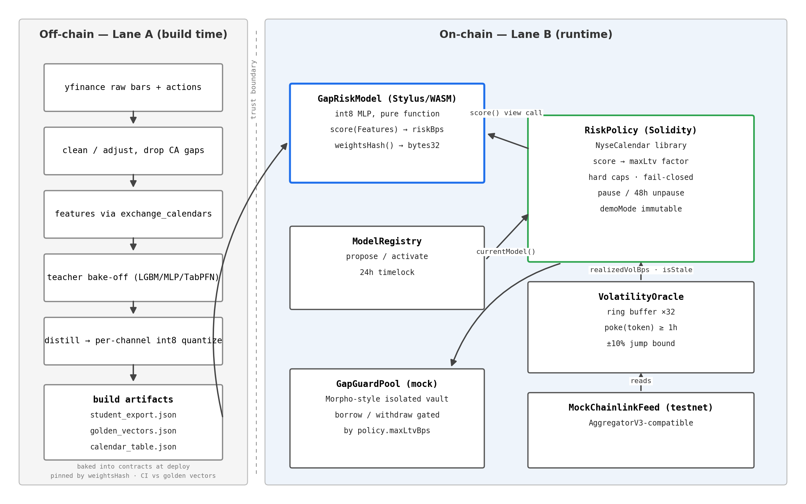

# GapGuard

*A Saturday-morning seatbelt for stock-backed loans — a tiny on-chain model that
feels the weekend coming and quietly tightens the straps.*

## What it is

GapGuard is an on-chain risk-parameter feed for stock-token collateral on Robinhood
Chain. Stock tokens trade 24/7; the reference market (NYSE/Nasdaq) does not, so
overnight and weekend price gaps are structural. GapGuard scores that gap risk
on-chain and turns the score into a dynamic max-LTV factor that any contract can
read synchronously, in the same transaction.

A tiny int8 MLP (the "student", 3–5K parameters, distilled from an off-chain
teacher) runs as a Stylus contract over chain-native and calendar-native features
only. A Solidity policy contract applies a monotonic step table, hard caps, and
fail-closed rules, and gates a mock lending pool. No operator can inject or
withhold data; vol-oracle freshness is permissionless — anyone can poke.
Inference is deterministic, weights are public, and a fooled model
cannot be profitable on its own.

## Architecture



[vector SVG](docs/architecture.svg) · regenerate both with `tools/render-architecture.py`

Trust boundary: everything on-chain needs no operator. The only off-chain artifact
that crosses the boundary is `student_export.json` (+ calendar table), pinned by
`weightsHash` and reproducible-build verification. Interface docs:
[`docs/interfaces/`](./docs/interfaces/student-export-format.md).

## Deployed contracts

> TBD (D3)

| Contract | Network | Address | Explorer |
|---|---|---|---|
| GapRiskModel (Stylus student) | Robinhood testnet 46630 | TBD | TBD |
| RiskPolicy (production, `demoMode=false`) | Robinhood testnet 46630 | TBD | TBD |
| RiskPolicy (demo, `demoMode=true`) | Robinhood testnet 46630 | TBD | TBD |
| VolatilityOracle | Robinhood testnet 46630 | TBD | TBD |
| ModelRegistry | Robinhood testnet 46630 | TBD | TBD |
| GapGuardPool (mock) | Robinhood testnet 46630 | TBD | TBD |

Network details and token/feed addresses:
[`docs/interfaces/deployments.md`](./docs/interfaces/deployments.md).

## Quickstart

> TBD (D2–D3) — commands below are placeholders; pinned versions land with
> `rust-toolchain.toml`.

```bash
# Contracts: unit + golden-vector + fuzz/invariant tests
forge test

# Stylus student: compile + dry-run activation (Docker required), then deploy
cargo stylus check
cargo stylus deploy --endpoint=https://rpc.testnet.chain.robinhood.com

# Model pipeline (Lane A): data → bake-off → distill → quantize → export
python -m gapguard.pipeline
```

## The model

- **Label:** `P(|open_t / close_{t−1} − 1| > 5%)` over the next close→open
  transition; exported as `riskBps = ceil(p × 10000)`.
- **Features:** 8-field chain-native/calendar-native vector —
  [`IGapRiskModel`](./docs/interfaces/IGapRiskModel.md). Close→open pairs spanning
  corporate actions are excluded from training labels. The position features
  (`ltvBps`, `concentrationBps`) are synthetically marginalized — sampled uniformly
  in training, with the adversarial fidelity grid sweeping their full range, so the
  score is certified position-independent.
- **Teacher bake-off** (LightGBM / tuned MLP / TabPFN-in-a-1h-box; time split;
  pinball @90/95, Brier, ECE):

> TBD (D1)

| Model | Pinball q90 | Pinball q95 | Brier | ECE |
|---|---|---|---|---|
| TBD | TBD | TBD | TBD | TBD |

- **Student–teacher fidelity:** worst-case |Δp| on the adversarial evaluation grid
  (boundary-weighted + PGD), acceptance threshold ≤ 200 bps fixed before
  distillation: **TBD (D2)**.
- **Calibration:** ECE after temperature fit (10 bins, netcal): **TBD (D3)**.
- **Gas:** per-inference measured vs 200k ceiling: **TBD (D3)**.

## Threat model

Primary attack vector: input manipulation. Secondary: white-box model search.

### Input manipulation & controls

Controls (all MVP-scope, DESIGN.md §3.4.25):

1. **Jump clamp:** the vol oracle rejects any observation that moves more than
   ±10% from the **last accepted observation**, with a ≥1h minimum per-token poke
   interval (`poke(token)` reverts `PokeTooSoon()` earlier). Observations
   themselves are the reference feed's current answer.
2. **Adversarial inputs move the score toward caution:** oracle staleness and
   deviation are model *features*, so gaming attempts raise `riskBps`, which
   tightens limits.
3. **Hard caps:** `MAX_LTV_HARD_CAP_BPS = 7000` binds regardless of score.
4. **Fail-closed:** any out-of-range feature, stale vol oracle (`isStale(token)`,
   >26h), paused reference feed, or paused policy → `maxLtv = 0`.
5. **Step table:** no gradient to surf — epsilon input nudges cannot buy a better
   limit.

**Trust assumption:** reference-feed integrity is trusted, not defended on-chain —
the mock feed on testnet is deployer-controlled; Chainlink on mainnet. The
contracts cannot detect a compromised feed; they can only bound how fast accepted
observations move (control 1).

### White-box model & residual risk

Weights are public by design. An adversary can search the feature space for blind
spots. Mitigations: hard caps, fail-closed, conservative rounding (scores round up,
limits round down), and the step table. Residual risk is acknowledged, not solved —
see Limitations.

### Economic exploit walkthrough

Canonical attacks table-topped before policy-math freeze (Wed 9/30 morning):
"wash-trade to spike vol → tighten rivals' limits" is **moot** — no AMM exists on
the deployment networks, so there is nothing to wash-trade; the manipulation
surface is reference-feed integrity (trust assumption above). The live attack is
"smooth own inputs → inflate own limit → walk away Monday" (caps bind; fail-closed
triggers).

> TBD (D2) — full writeup after the threat-model session.

### Guardian / kill-switch honesty

The guardian can `pause()` instantly (all limits → 0). MVP guardian is the deployer
EOA — a real, documented centralization point. Unpause requires a 48h timelock;
model updates require a 24h timelock via the registry. M5 moves the guardian to a
2-of-3 Safe. The pause power cannot raise limits or take funds; it can only stop
the system.

The deployer also fixes the **token set** (base LTVs, asset classes, reference
feeds) at construction: immutable, visible in the deploy transaction, changeable
only by redeploy.

### Keeper / liveness honesty

At MVP the team runs a **convenience keeper** calling `poke(token)` ≥1×/26h per
registered token. `poke` is permissionless — anyone can substitute. A down keeper
only **fails closed** (`maxLtv = 0`); it can never open risk or inject data.

### Sequencer compliance screening note

Robinhood Chain's sequencer excludes sanctioned-address transactions (official
docs). GapGuard does not depend on this; it is noted because it is a property of
the deployment environment, not of the protocol.

## How we differ from Sigma

Sigma (github.com/dmetagame/sigma) is a Stylus on-chain risk engine for
tokenized-equity collateral from the London Open House buildathon: parametric VaR,
**owner-updated vols**, testnet-only, dormant. GapGuard is disjoint on every axis
that matters:

| | Sigma | GapGuard |
|---|---|---|
| Risk object | parametric VaR | **gap risk from market-closure structure** (24/7 token vs 24/5 reference) |
| Model | parametric | **distilled int8 neural student**, fidelity measured adversarially vs teacher |
| Inputs | owner-updated vols (operator in the loop) | **no operator data inputs** — chain/calendar-native features; vol freshness is permissionless, anyone can poke |
| Weights | — | **public**, hash-pinned (`weightsHash`), reproducible builds |
| Status | testnet-only, dormant | deployed + verified (see Deployed contracts) |

No production risk/vol oracle exists on Robinhood Chain; GapGuard is built to be
that public good.

## Judging criteria → evidence

> TBD (D1–D4) — evidence cells fill as artifacts land.

| Criterion | Evidence |
|---|---|
| Innovation | TBD |
| Technical implementation | TBD — tests, fuzz/invariant results, gas table, golden-vector CI |
| Use of Arbitrum technology | TBD — Stylus int8 inference, `cargo stylus verify`, Stylus gas profile |
| Potential impact | TBD |
| Presentation quality | TBD — demo video ≤2:00, pitch video ≤2:00 |

## Reproducibility & verification

- Stylus deploys build in a pinned Docker container (reproducible by default).
- Repo commits `Cargo.lock` + `rust-toolchain.toml`; judge/auditor flow:

```bash
cargo stylus verify --deployment-tx <DEPLOY_TX_HASH>
```

- `weightsHash()` on-chain = keccak256 of the canonical `student_export.json` —
  serialization defined precisely in
  [`docs/interfaces/student-export-format.md`](./docs/interfaces/student-export-format.md).
  The registry's `ModelActivated` events are the public audit trail.
- Golden vectors: the student must match all 100 quantized-reference vectors
  exactly in CI.

## Roadmap (post-hackathon)

Prize payout is 25% signing / 25% 1-month check-in / 50% mainnet launch + KPI, so
milestones are written as milestone candidates:

- **M1** — Mainnet deployment, monitoring/alerting, model registry with pinned
  weight-hash + timelocked updates (incl. Stylus keepalive against the ~365-day
  program expiry).
- **M2** — Live Chainlink Data Feeds/Streams integration (replace mocks); first
  external consumer (Morpho-style vault or agent wallet reading the feed).
- **M3** — Bonded attestation layer for teacher-grade scores: off-chain heavy model
  posts scores with a bond; on-chain student as watchdog; disagreement > τ →
  flag/pause. (Reserved extension slot —
  [`IModelRegistry`](./docs/interfaces/IModelRegistry.md).)
- **M4** — Deterministic dispute game: bisection over layers, one-step arbitration
  in Stylus, slashing; verdict computed, not voted.
- **M5** — Governance: 2-of-3 Safe multisig + timelocks for model updates, kill
  switch policy, recalibration cadence.
- **M6 (stretch)** — ZK verifier slot in the update interface (proof-agnostic
  updates: attestation or proof); Laya semantic layer for natural-language mandate
  checks (input-oracle problem must be addressed first).

## Limitations

- **White-box residual risk:** public weights + adversarial feature search can find
  blind spots the evaluation grid missed. Caps and fail-closed bound, not
  eliminate, the damage.
- **Calendar table coverage ends 2028**; deployments past the table need a
  redeployed calendar.
- **24/5 reference feeds:** weekend feed staleness is a feature input, not an error
  — but a feed that dies *during* the week fails closed (limits → 0) until it
  recovers.
- **`stalenessSecs` saturates at ~18.2h** (65535 s cap, by design); weekend
  differentiation is carried by the calendar features, not by staleness.
- **Token set fixed at deploy** — new tokens need a redeploy (M5 governance item).
- **Position features are synthetic:** `ltvBps` / `concentrationBps` are
  synthetically marginalized in training (sampled uniformly), not learned from
  lending data; the score is certified position-independent via the fidelity grid.
- **Vol-oracle freshness needs one poke per token per 26h** (permissionless; team
  convenience keeper at MVP) — keeper downtime freezes limits to 0, never loosens.
- **Mock pool:** the vault demonstrates the consumer shape; it is not production
  lending code.
- **Guardian EOA at MVP** — documented centralization, multisig at M5.
- **Single-asset, per-token limits** — no portfolio netting or cross-margining.
- Not financial advice; this is infrastructure — a risk-parameter feed.

## License

> TBD (D4)
